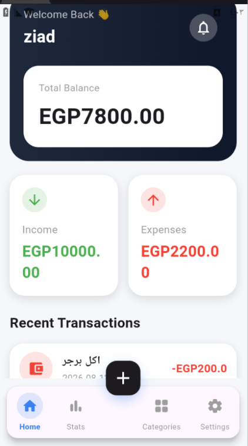
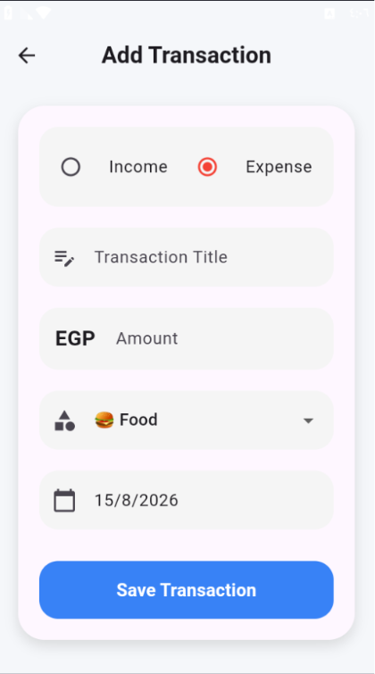
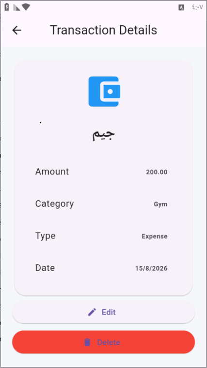
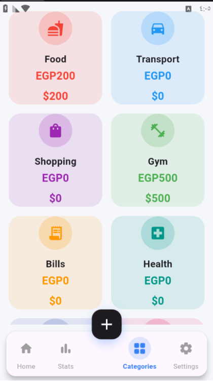
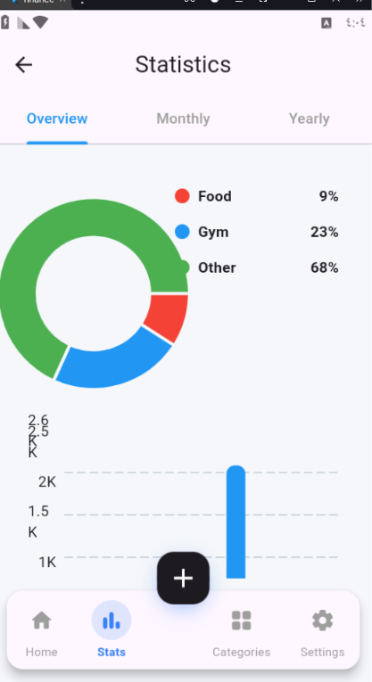
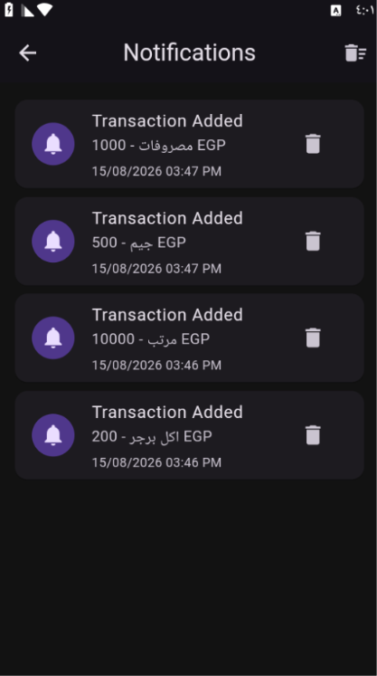

# 💰 Finance Tracker

<p align="center">
  
</p>

<p align="center">
  <b>A modern Flutter application for managing personal finances.</b>
</p>

<p align="center">
  Track your income, expenses, transactions, and financial activity in one organized and intuitive application.
</p>

---

## 🎥 App Demo

<p align="center">

<a href="https://github.com/user-attachments/assets/3cd45dbb-4d7d-4a40-84c2-8eada508031c">
  ▶️ <strong>Watch ARChat Demo</strong>
</a>

</p>

## 📱 Screenshots

### 🏠 Home

<p align="center">
  
</p>

The Home screen provides a clear overview of the user's financial activity and important information.

---

### 💳 Transaction Tracker

<p align="center">
  
</p>

Track and manage your financial transactions in an organized and easy-to-use interface.

---

### 📄 Transaction Details

<p align="center">
  
</p>

View detailed information about each transaction, including its amount, category, date, and other relevant details.

---

### 🗂️ Categories

<p align="center">
  
</p>

Organize and manage financial transactions by different categories to make spending easier to track and analyze.

---

### 📊 Statistics

<p align="center">
  
</p>

Analyze your financial activity through interactive charts and visual reports, including income, expenses, and spending distribution.

---

### 🔔 Notifications

<p align="center">
  
</p>

Stay informed about important financial activities and application updates.

---

## 📌 Overview

**Finance Tracker** is a modern Flutter application designed to help users manage their personal finances in a simple and organized way.

The application provides tools for tracking income and expenses, managing transactions, analyzing financial activity, and organizing financial data.

---

## ✨ Features

- 🔐 **Firebase Authentication**
  - Secure user registration and login.

- 💰 **Transaction Management**
  - Add, edit, and manage financial transactions.

- 📊 **Financial Analytics**
  - Visualize income and expenses through interactive charts.

- 🗂️ **Categories**
  - Organize transactions by different categories.

- 📄 **Transaction Details**
  - View detailed information for individual transactions.

- 📈 **Statistics**
  - Analyze income, expenses, and spending distribution using interactive charts.

- 🔔 **Notifications**
  - Receive important application notifications.

- 👤 **Profile & Settings**
  - Manage user information and application preferences.

- 💾 **Local Data Storage**
  - Store financial data locally using Hive.

- 🔄 **Backup & Restore**
  - Backup and restore application data.

- 🎨 **Custom Theme**
  - Modern and personalized application interface.

---

## 🛠️ Technologies

- **Flutter**
- **Dart**
- **Flutter Bloc / Cubit**
- **Firebase Authentication**
- **Hive**
- **FL Chart**
- **Pie Chart**
- **Font Awesome Icons**

---

## 🏗️ Project Architecture

The project follows an organized Flutter architecture:

```text
lib/
│
├── cubit/
│   └── State management & business logic
│
├── models/
│   └── Application data models
│
├── views/
│   └── Application screens
│
├── widgets/
│   └── Reusable UI components
│
└── helpers/
    └── Utility functions & shared resources
```

---

## 🔗 Project Links

<p align="center">
  <a href="https://github.com/aa8273-commits/finance-tracker">
    
  </a>

  <a href="https://www.linkedin.com/in/abdulrahman-ahmed-ibrahim-400151360">
    
  </a>
</p>

---

## 👨‍💻 Developer

**Abdulrahman Ahmed Ibrahim**

Flutter Developer

- 🔗 GitHub: https://github.com/aa8273-commits
- 💼 LinkedIn: https://www.linkedin.com/in/abdulrahman-ahmed-ibrahim-400151360

---

<p align="center">
  Made with ❤️ using Flutter
</p>